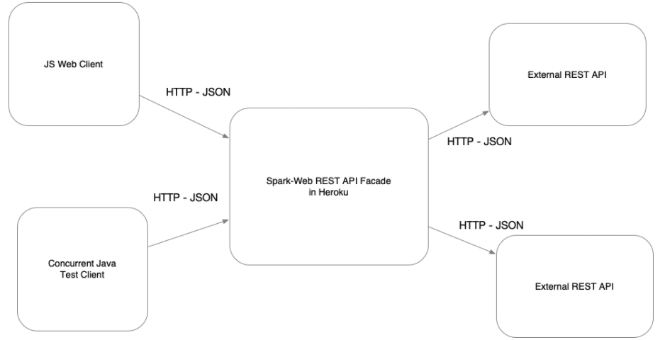
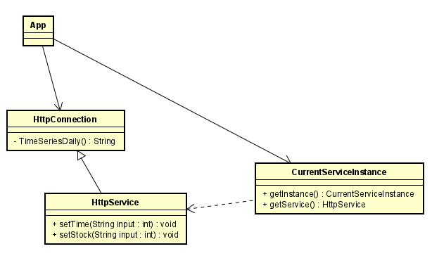
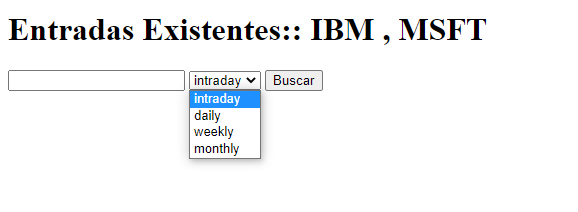
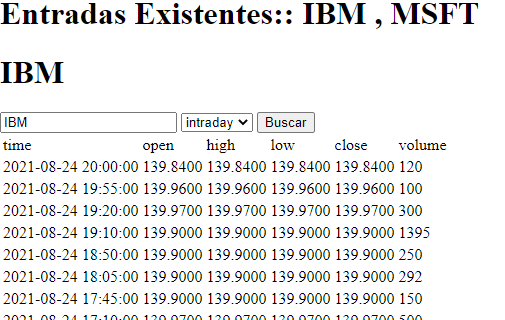

### Escuela Colombiana de Ingeniería
### ARQUITECTURAS EMPRESARIALES - AREP
## Tarea Introducción mvn-git y Heroku

### Introduccion:
construir una aplicación para consultar el mercado de valores de las acciones negociadas en la bolsa
es deber del desarrollador facilitarle al usuario la consulta de histórico de la valoración (intra-día, diaria, semanal y mensual)   

**Estructura del programa**

el programa está conformado por la clase principal que es App el la encargada de entregarnos los datos en un formato .json, esta 
estructura nos ayudara mucho a la hora mostrar los datos al usuario.
Pero app necesita hacer la conexión con el browser donde entra al juego la clase “HttpConnection“ ahí es donde actúa nuestro cliente 
Java, aparte necesitamos el link del api el cual queremos hacer la búsqueda de la bolsa de valores ahí es donde actúa la clase 
“HttpService”, dicha clase hace las modificaciones pertinentes para que el api sea valido y nos otorgue la información que necesitamos 
mostrar.

**como se puede extender el programa?**

solo se agregaría una nueva clase heredada de HttpConnection la cual haría la misma función de HttpService esta función es modificar
el link de tal manera que el api nos otorgue la información que estamos solicitando.

También toca hacer nuevos .gets en la clase app con sus métodos implementados, la implementación es muy similar a las que se hace en 
todos los gets implementados, lo único diferente es que le hace un llamado a la nueva clase creada.

por ultimo y no menos importante mostrar los datos en el index, pero es solo cuestion de ajustar las tablas con las entradas dadas por el archivo .json

## Interface de la aplicacion:

la interface no es muy difícil de usar solo toca dar las siglas de la bolsa de valores que queremos buscar, después encontramos una barra con los históricos
 disponibles de dicha acción, le damos a buscar y nos dará los resultados de la siguiente manera:

